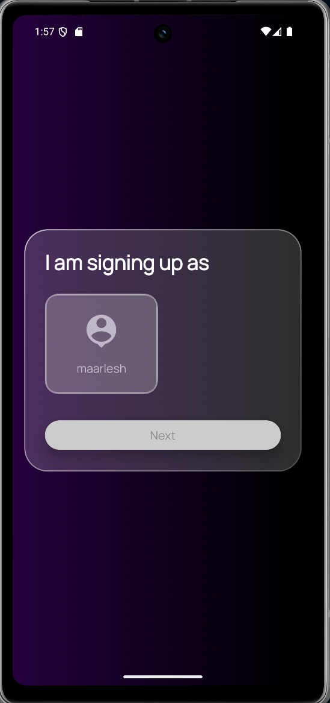

# Local Expenses Tracker

A mobile application for tracking personal expenses and incomes, built with Kotlin and Jetpack Compose on Android. The app provides a clean and responsive UI to manage accounts, categorize transactions, and visualize monthly expenses and incomes efficiently.

## Features Overview

### User Profile Management
- **Create and manage multiple user profiles**.
- On app launch, users select or create their profile.
- Each profile maintains separate financial data.

### Home Screen
- **Account Carousel**: Displays accounts for the selected user profile.
- **Add Account**: Bottom sheet modal to create new accounts.
- **Month Switcher**: Navigate and filter transactions by month and year.
- **Transaction History**: Scrollable list showing income and expenses for the selected month.
- Supports combined transaction view with clear distinctions between income and expenses.

### Bottom Navigation Bar
- Navigation menu across major app features.
- Central floating **"+" button** to quickly add new Categories, Income, Expense, or Transactions.

### Creation Screens
- Unified and intuitive forms for adding/editing:
    - **Categories**
    - **Income**
    - **Expense**
    - **Transactions**
- Toggle switches or segmented controls to distinguish between income and expense within the transaction form.
- Modern Material3 date picker integration for setting transaction dates.

---

## User Flow Summary

1. **Profile Selection Screen**
    - Users can create or select one of multiple profiles.
    - Each profile encapsulates personal financial data.

2. **Home Screen**
    - After profile selection, users see accounts in a horizontal carousel.
    - Tap "+ Add Account" to open a bottom sheet and create accounts.
    - Use the month switcher to filter transactions shown below.
    - Scrollable transaction history is displayed grouped by month.

3. **Navigation and New Entries**
    - Bottom nav bar provides access to categories, income, expense, and transaction creation screens.
    - "+" button opens quick creation options.

---

## Technologies Used

- Kotlin and Jetpack Compose for UI and app logic
- Room for local database and persistence
- Hilt for dependency injection
- Material3 Compose for modern theming and components
- StateFlow, Coroutines for reactive and asynchronous data handling

--

Screenshots:

